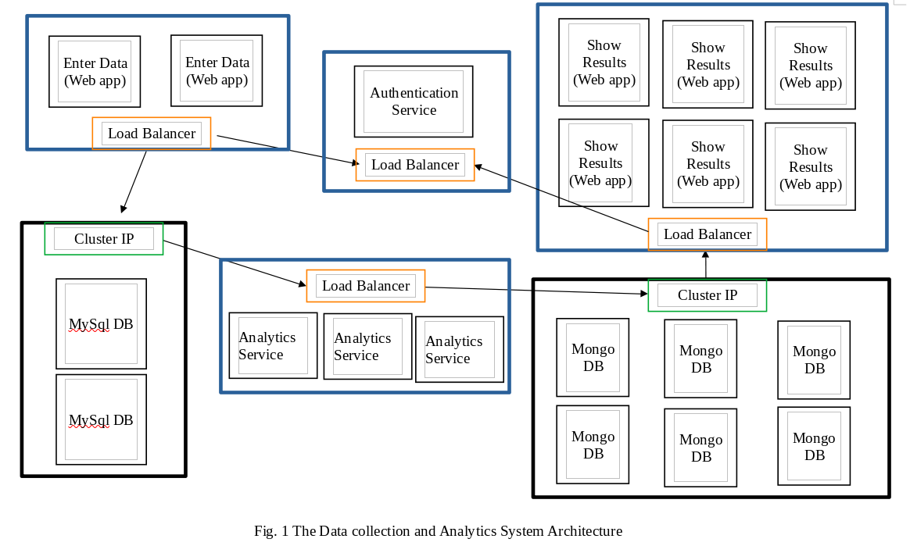

# ACIT3495-Project: K8s Deployment

2022 (C) BCIT

## Application Use-Case
**Open Weather Service API** is built for weather monitoring agencies. It provides an application service to compute raw data that has been collected, and analzes and processes the raw data into a user-friendly Application Programming Interface for frontend applications

**Open Weather Service API** provides the following functionality:

-  Exposes an API to send data over HTTP to a frontend with API calls.
-  Services are loosely coupled and scalable.

### Microservices Design
The application is divided into 5 services:
1.  **Express.js** webclient
2.  **MySQL** for raw data
3.  **Node.js** analytics service
4.  **MongoDB** for computed data
5.  **Python-flask** application for API service

Authorisation is managed by a JWT service

## Architecture Description
Open Weather Service works in the following steps: 

1.  Weather data of temperatures is deposited by an administrator.
2.  The temperature data is saved to a relational database.
3.  The data is divided into tables by datetime.
4.  The minimum value, maximum value, and average value is computed.
5.  The computed values are saved in a non-relational database
6.  The computed data is served over HTTP to a frontend with REST API calls.

### User Interfaces
**Admin Client**
-   Weather Service portal for uploading raw temperature data.
-   Data can be uploaded as a Comma Separated Values (CSV) file.
-   Saves raw data and computed data in separate in containers
-   Requires Admin Authorisation

**User Client**
-  Weather application
-  Presents organised temperature information with useful summary
-  User account required for authorisation

### Databases
Uses two different databases.
1.  MySQL for raw data. The data is divided into tables by datetime.
2.  NoSQL(MongoDB) for computed data
Raw data is computed for minimum, maximum, and average values.

## Microservice Architecture Description

**Frontend**
-   **Reverse proxy**: Serves a static webpage that receives data from the Frontend API's.
-   **Admin frontend server**: Administator uploads CSV files with raw data. CSV files are uploaded as a POST request from the input form
-   **User frontend server**: Serves weather data with analysis. Responds with JSON to GET requests from frontend.

**Backend**
-   **MySQL Database**: Stores raw data in tables. Tables are created for each day.
-   **Analytics Server**: Processes raw data for statistics. The minimum value, maximum value, and average value is computed and saved to a MongoDB collection.
-   **MongoDB Datastore**: Serves post-processed data to User frontend Server

### Horizontal Scalability

Figure 1: Data collection and Analytics System Architecture</img>

**Application Scalability**:
The frontend services are required to scale horizontally to reach a greater user base. In order to do this, not every part of of the application can scale well.

The User frontend service can scale more than the other services because it has a smaller datastore with MongoDB which can handle scaling needs, and therefore can benefit from more replica sets in the Cluster. It also needs to reach users, which are the primary source of traffic.

Tha Admin frontend does not need to scale as much, because there are not many administrators and the frontend service requires the MySQL database.

**Database Scalability**:
The MongoDB datastore is updated with post-processed data from the analytics server from the MySQL database cluster, which does not scale well. However, as mentioned previously, it is not required. The Analytics service does neet to balance the lower scaling needs of the MySQL database, and reach the higher scaling needs of the MongoDB. This is the main point of failure in the application, and would require load balancing to manage properly.

## Repository
GitHub: https://github.com/AlexVisca/ACIT3495-K8s.git
